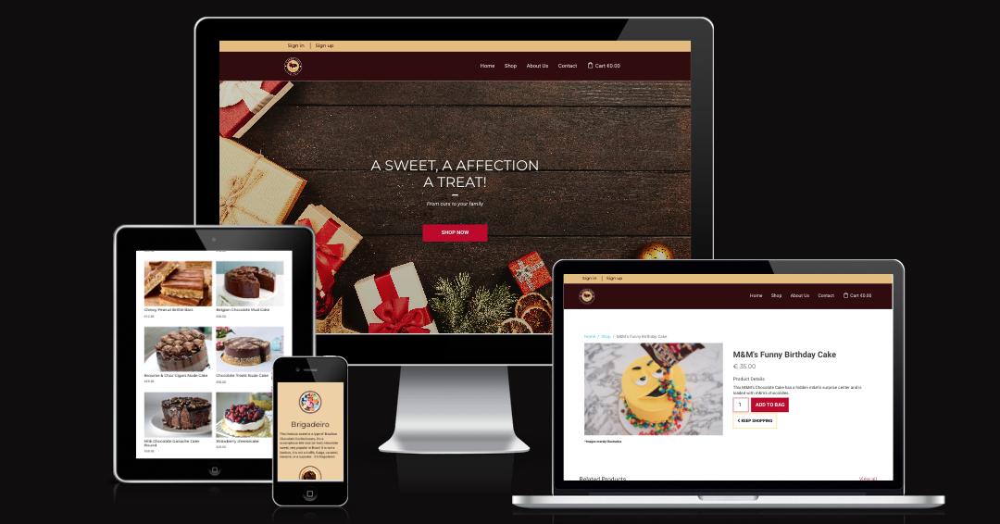

# Candy Care Dublin

The live link can be found <a href="https://candycaredublin.herokuapp.com/" target="_blank" rel="noopener">here</a>.

This project was created as part of the Full Stack Software Development course offered by Code Institute.

# Table of Contents

- [Candy Care Dublin](#candy-care-dublin)
- [Table of Contents](#table-of-contents)
- [Briefing](#briefing)
- [The challenge](#the-challenge)
  - [Business Rules](#business-rules)
  - [Screens](#screens)
- [User Experience | UX](#user-experience--ux)
  - [User Stories](#user-stories)
    - [User](#user)
    - [Admin](#admin)
    - [Developer](#developer)
  - [Design Choices](#design-choices)
    - [Typography](#typography)
    - [Color palette](#color-palette)
- [User Interface | UI](#user-interface--ui)
  - [Features](#features)
    - [Existing Features](#existing-features)
      - [Main Navigation Bar](#main-navigation-bar)
        - [Secondary Navigation Bar](#secondary-navigation-bar)
      - [Hero Image](#hero-image)
      - [About](#about)
      - [Product Showcase](#product-showcase)
      - [Occasions](#occasions)
      - [Newsletter Form](#newsletter-form)
        - [Thank you Page](#thank-you-page)
      - [Social Networks](#social-networks)
      - [Footer](#footer)
- [Project Architecture](#project-architecture)
  - [Project settings structure](#project-settings-structure)
    - [Development environment](#development-environment)
    - [Testing environment](#testing-environment)
    - [Production environment](#production-environment)
  - [Data Storage](#data-storage)
    - [Database schema](#database-schema)
    - [User Table](#user-table)
    - [Profile Table](#profile-table)
    - [Product Table](#product-table)
    - [Category Table](#category-table)
    - [Occasion Table](#occasion-table)
    - [Order Table](#order-table)
    - [Order Line Table](#order-line-table)
- [Technologies Used](#technologies-used)
  - [Languages](#languages)
    - [Front-end](#front-end)
    - [Back-end](#back-end)
  - [Frameworks](#frameworks)
  - [Libraries](#libraries)
  - [Tools](#tools)
- [Testing 🔎](#testing-)
  - [Test Driven Development (TDD)](#test-driven-development-tdd)
  - [Manual tests](#manual-tests)
  - [Testing User Stories](#testing-user-stories)
  - [Bugs Report 🐞](#bugs-report-)
- [Deployment](#deployment)
  - [Forking the GitHub Repository and Running this Project Locally](#forking-the-github-repository-and-running-this-project-locally)
    - [Installing virtualenv](#installing-virtualenv)
    - [Creating a new virtualenv](#creating-a-new-virtualenv)
    - [Activating a virtualenv](#activating-a-virtualenv)
  - [Database setup](#database-setup)
  - [Setting up heroku](#setting-up-heroku)
- [Credits](#credits)
  - [Media](#media)
- [Acknowledgements](#acknowledgements)
- [Disclaimer](#disclaimer)
- [Author](#author)

# Briefing

**Candy Care Dublin** is a small company that started in a homely environment, with the idea of ​​making homemade cakes for the people who lived nearby. However, people liked it and recommended it to other people. The business has expanded and today **Candy Care Dublin** has clients that go beyond the surroundings, as well as in other cities. The main means of publicizing the business is through a page on social networks (Facebook and Instagram) but, with the exponential growth of the business, there was a need to create a website, where people could access, see the products available, add to cart and finally checkout the purcharse. In this way, it would no longer be necessary to make sales via Instagram or Facebook, which would facilitate the administration of the business.

# The challenge

With this idea in mind, the person in charge of **Candy Care Dublin** hired me to develop a fullstack web application for the company.

An e-commerce web application is expected to be delivered that meets the following needs:

> 1. A website whose purpose of the company is immediately understood by the user.
> 2. Have a clear information on what the site is about and what it provides
> 3. Have an easy navigation that is consistent throughout the website
> 4. That the user can easily view the list of available products.
> 5. That the user can easily add an specific item to the bag and identity the total cost of the purchase and all items they will receive.
> 6. That the user can easily enter their payment information and be sure their personal and payment information are safe and secure.

_For admin_

> 7. A functionality where the app admin can easily add one or more products, edit and/or delete an specific product.

## Business Rules

The application's administrative functions are intended to manage what each user can do within the system. Permissions such as adding, editing or removing a property, for example, should under no circumstances be given to the user of the application. Such functionalities must be assigned exclusively to the administrator.

In the system, there will be the following user functionalities:

- Admin: has permission in all areas of the system.
- Users: can edit your own profile like change profile picture or change password. The user can list all the available products and sort them by **Price** and **Name**, add one or more products to their bag, identity the total cost of their purchase and all items they will receive, edit their bag by removing an specific product from the bag or adding another one, before checkout. The user should be able to receive an e-mail containing all the details about their purchase such as the list of products, the total cost, the delivery address, and so on.

## Screens

- Admin:
  - Add/Edit/Remove products.
  - View all screens users can view as well.
- Users:
  - Can log in and out of the application.
  - Can manage their own profile.
  - Can sign up to the newsletter form.
  - Can add one or more products to their bag.

[Back to top ⇧](#table-of-contents)

# User Experience | UX

## User Stories

### User

- As a **Shooper** I want to be able to **quickly identify deals, clearance items and special offers** so that **I can take advantage of special savings on products I would like to purchase**.
- As a **Shooper** I want to be able to **easily view the total of my purchases at any time** so that **be aware of how much I've already spent and avoid spending too much**.
- As a **Shooper** I want to be able to **easily register for an account** so that **I can have a personal account and be able to view my profile**.
- As a **Shooper** I want to be able to **easily login or logout from my account** so that **I can access my personal account information**.
- As a **Shooper** I want to be able to **easily recover my password in case I forget it** so that **I can recover access to my account**.
- As a **Shooper** I want to be able to **receive a confirmation email after registering** so that **I can verify that my account registration was successful**.
- As a **Shooper** I want to be able to **have a personalized user profile** so that **I can view my personal order history and order confirmations, and save my payment information**.
- As a **Shooper**, I want to be able to **sort the list of available products** so that **I can easily identify the best priced and categorically sorted products**.
- As a **Shooper**, I want to be able to **sort a specific category of product** so that **I can find the best-priced product in a specific category, or sort the products in that category by name**.
- As a **Shooper**, I want to be able to **sort multiple categories of products simultaneously** so that **I can find the best-priced or best-rated product across broad categories, such as "vegan" or "best sellers.**.
- As a **Shooper**, I want to be able to **search for products by occasion, such as "birthdays" or "father's day"**.
- As a **Shooper**, I want to be able to **easily see what I have searched for and the number of results** so that **I can quickly decide whether the product I want is available**.

### Admin

- As a **Site Admin** I want to be able to **easily add a product** so that **I can add new items to my store**.
- As a **Site Admin** I want to be able to **see all existing products** in a simple and easy manner.
- As a **Site Admin** I want to be able to **edit/update a product** so that **I can change product prices, descriptions, images and other product criteria**.
- As a **Site Admin** I want to be able to **delete a product** so that **I can remove items that are no longer for sale**.

### Developer

- As a **Developer** I want to ensure that **all application features work** as they were implemented to work.
- As a **Developer** I want to ensure **an authenticated user can access** all required information correctly.
- As a **Developer** I want to **work together with the administrator** of the site for **improvements** for the user of the same.

## Design Choices

### Typography

As a primary font, I have chosen to use [Roboto](https://fonts.google.com/specimen/Roboto) since Roboto has been designed for screens and includes 12 different font weights, from thin to black. Roboto also allows letters to take up as much space as it needs and ultimately, making for an improved experience for the user.

As a secondary font I have chosen to use [Montserrat](https://fonts.google.com/specimen/Montserrat) once Montserrat really shines for short pieces of all caps and the geometric simplicity of the letters. It is classified as a _sans serif_ with 18 styles and 9 weights. This typeface is similar to Proxima Nova, Gotham, Futura, Arial and Helvetica.

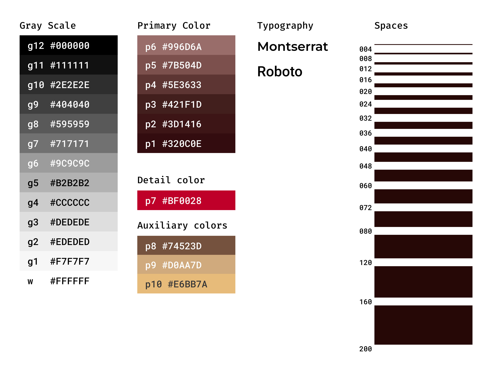

### Color palette

The colors used throughout the project were extracted from the logo.

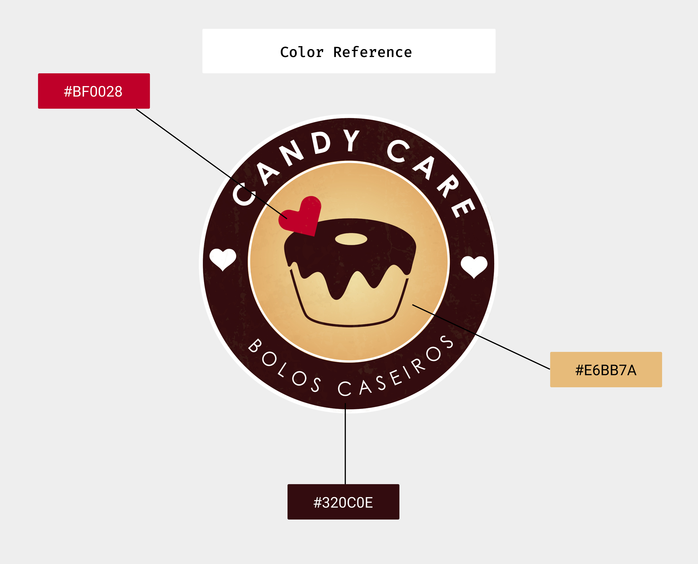

[Back to top ⇧](#table-of-contents)

# User Interface | UI

<div style="text-align: center;">
  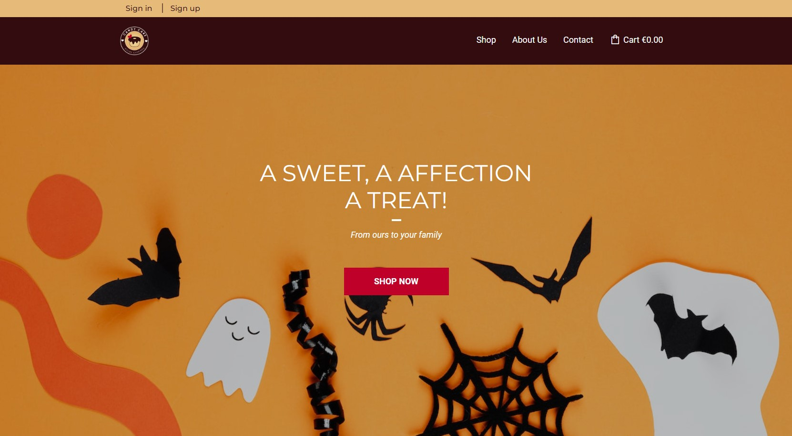
</div>

## Features

### Existing Features

#### Main Navigation Bar


##### Secondary Navigation Bar


#### Hero Image


#### About

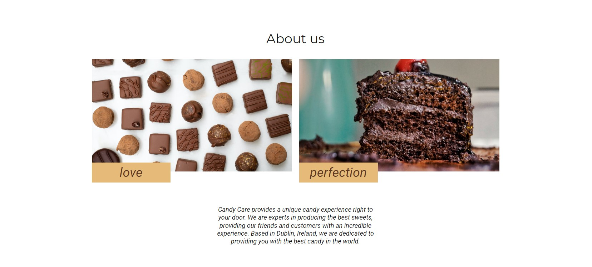

#### Product Showcase

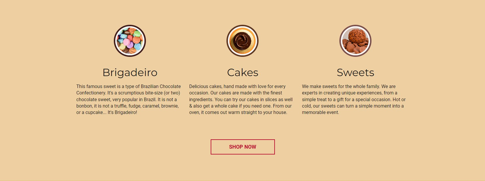

#### Occasions

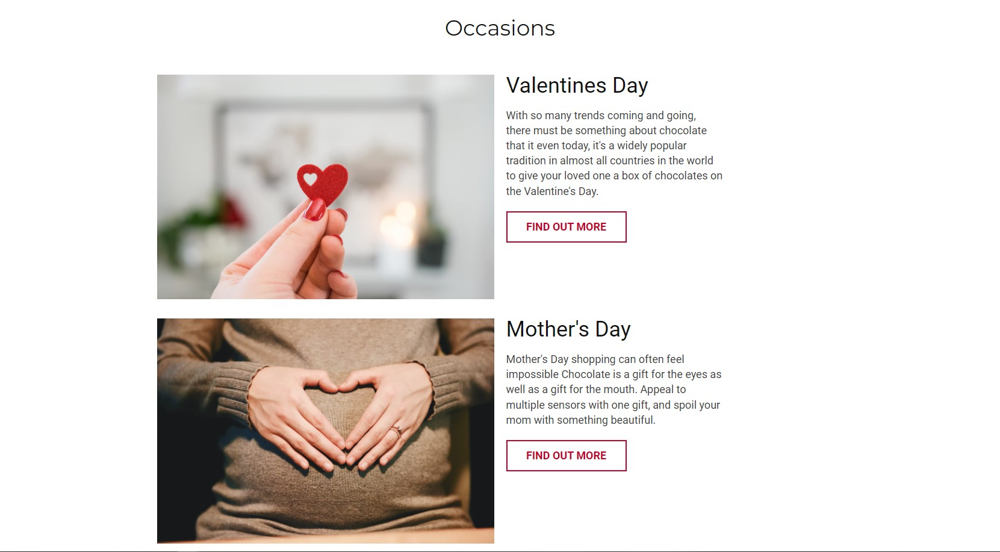

#### Newsletter Form


##### Thank you Page

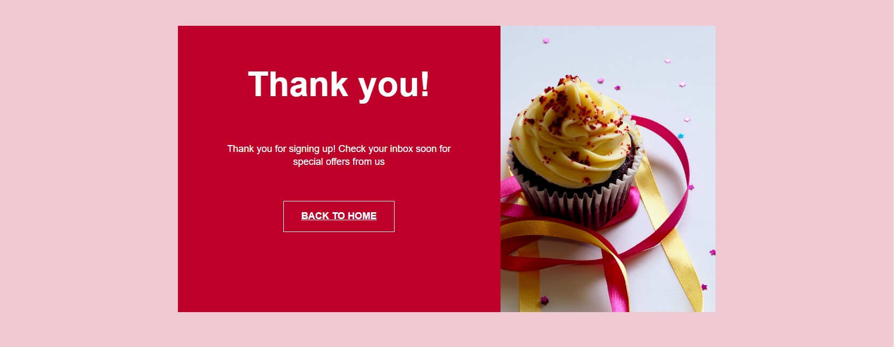

#### Social Networks

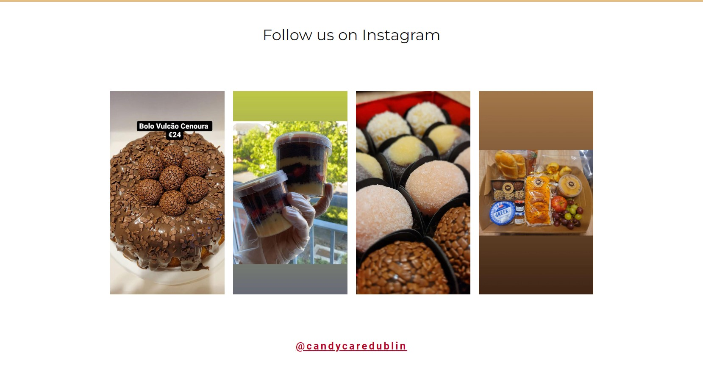

#### Footer

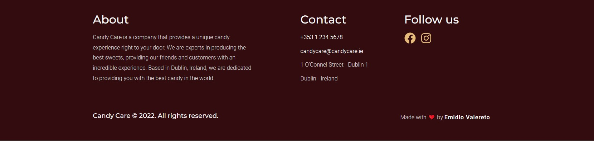

[Back to top ⇧](#table-of-contents)

# Project Architecture

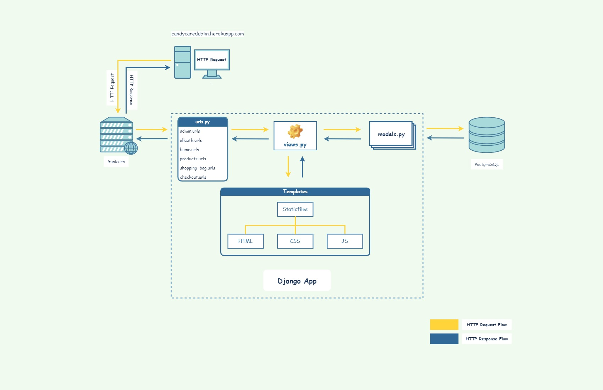

[Back to top ⇧](#table-of-contents)

## Project settings structure

The configuration file is one of the most important elements in any Django project. Knowing this, I decided to divide the configuration files structure into four files, one of them being the base file, which will contain everything that is needed in any project environment, be it **production**, **development** or **testing**. The other three files are for development, testing and finally production environments.

For that, create a folder called `settings` inside the main project folder. Inside it, add the `development.py`, `testing.py`, `production.py` and `__init__.py` files. After that, take the base `settings.py` file (which is in the root of the main project folder) and move it into the settings folder.

We will do this so that within the `settings.py` file there are only elements that will be used in any of the environments, be it production, testing or development. However, whatever we need to create differently for each environment, we will put it in the files we just created.

For this project, both the development and test environments use the `sqlite` database locally, while the production environment uses the `Postgresql` database. That way, development and testing data doesn't mix with the data that will be in production. To do this kind of separation, we must place the database settings in their respective files.

See below how the project structure should look 👇

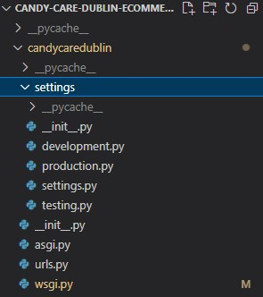

Now, we will need to open each file and add some settings.

### Development environment

```
from .settings import *

DEBUG = True

SECRET_KEY = os.environ.get("SECRET_KEY_DEVELOPMENT")
ALLOWED_HOSTS = ["localhost", "127.0.0.1"]

DATABASES = {
    'default': {
        'ENGINE': 'django.db.backends.sqlite3',
        'NAME': BASE_DIR / 'db.sqlite3',
    }
}

```

### Testing environment

```
from .settings import *

DEBUG = True
SECRET_KEY = os.environ.get("SECRET_KEY_TESTING")
ALLOWED_HOSTS = ['localhost', '127.0.0.1']

DATABASES = {
    'default': {
        'ENGINE': 'django.db.backends.sqlite3',
        'NAME': BASE_DIR / 'db.sqlite3',
    }
}
```

### Production environment

```
import os
import dj_database_url
from .settings import *

if os.path.exists("env.py"):
    import env

DEBUG = False
SECRET_KEY = os.environ.get("SECRET_KEY_PRODUCTION")
ALLOWED_HOSTS = [os.environ.get("HEROKU_HOST")]

DATABASES = {'default': dj_database_url.parse(os.environ.get("HEROKU_DB"))}

```

Remembering that it is good programming practices not to leave SECRET_KEYS visible as this will result in the vulnerability of the application. Therefore, generate your own secret keys and configure them through environment variables.

You can use Python `os` library to set your environment variables and then import them into the files, as I exemplify below:

```
import os

# SECRET KEYS
os.environ.setdefault("SECRET_KEY_DEVELOPMENT", "YOUR SECRET KEY")
os.environ.setdefault("SECRET_KEY_PRODUCTION", "YOUR SECRET KEY")
os.environ.setdefault("SECRET_KEY_TESTING", "YOUR SECRET KEY")

```

Once that's done, don't forget to remove the database settings and secret key from the `settings.py` file.

It is worth mentioning that with this change in the project structure, you will need to change some more settings, so that the application works correctly. By default, in the `settings.py` file, the `BASE_DIR` variable looks like this: `BASE_DIR = Path(__file__).resolve().parent.parent`. You will need to add a new `.parent` as there has been a subdivision of the main project folder. So the `BASE_DIR` variable should look like this: `BASE_DIR = Path(__file__).resolve().parent.parent.parent`.

Also, in the `wsgi.py` file you will need to notice that by default, the environment variable setting will look like this:

```
import os

from django.core.wsgi import get_wsgi_application

os.environ.setdefault("DJANGO_SETTINGS_MODULE",
                      "candycaredublin.settings")

application = get_wsgi_application()
```

Since three independent environments were created, we need to tell Django which environment we are going to work with. In this way, it is necessary to add, right after `settings`, the environment name.

If working in the development environment, add `.development`. If working in the testing environment, add `.testing` and so on.

The same thing should apply to the `manage.py` file which by default appears as

```
import os
import sys


def main():
    """Run administrative tasks."""
    os.environ.setdefault('DJANGO_SETTINGS_MODULE',
                          'candycaredublin.settings')

    # The rest of the code was hidden to optimize the page. Do not remove anything after this line.
    ...
```

If working in the development environment, add `.development` after `settings`. If working in the testing environment, add `.testing` and so on.

Be sure to change it each time you are working in a different environment.

With the project configured correctly, when running the application, you will see something similar to this.


[Back to top ⇧](#table-of-contents)

## Data Storage

### Database schema

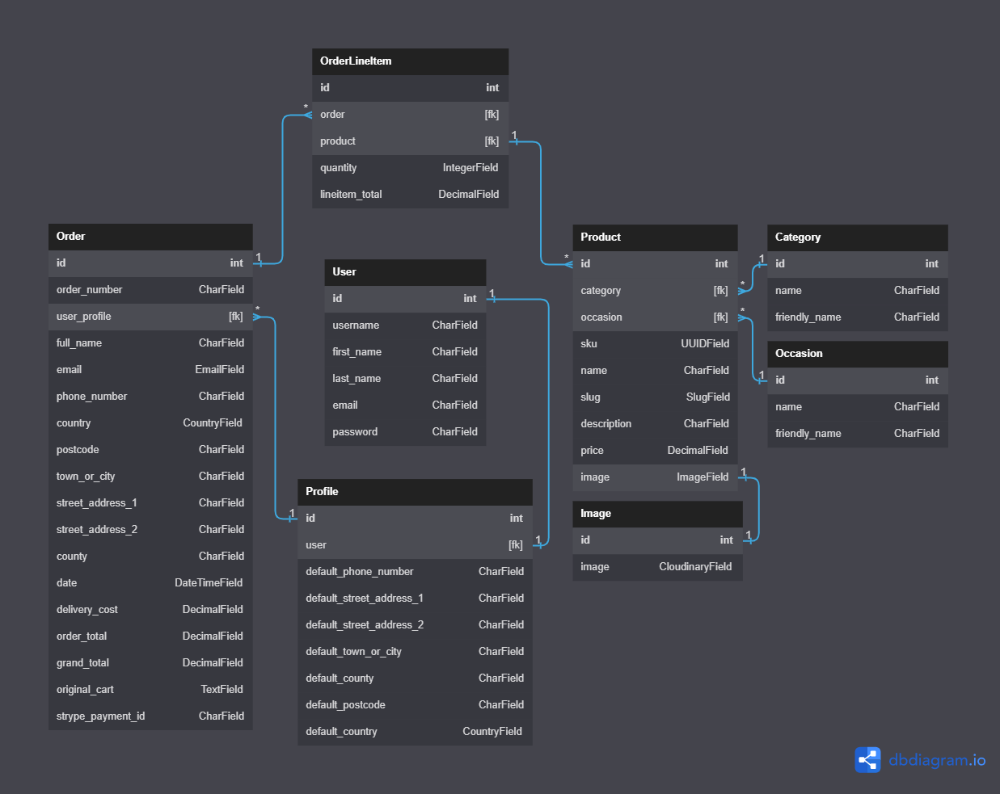

### User Table

| Title          | Key In Database | Form Validation           | Data Type   |
| -------------- | --------------- | ------------------------- | ----------- |
| id             | id              | auto-increment            | Primary Key |
| Username       | username        | max_length 20             | CharField   |
| First Name     | first_name      | max_lenght 20             | CharField   |
| Last Name      | last_name       | max_lenght 20             | CharField   |
| E-mail Address | email           | Must contain @ & .com etc | EmailField  |
| Password       | password        | max length 50             | CharField   |

### Profile Table

Once a user registers in the system, a profile is automatically created for that user.

| Title                    | Key In Database          | Form Validation                              | Data Type    |
| ------------------------ | ------------------------ | -------------------------------------------- | ------------ |
| Id                       | id                       | auto-increment                               | Primary Key  |
| user                     | user                     | max length 50                                | Foreign Key  |
| Default Phone Number     | default_phone_number     | max_length=20, null=True, blank=True         | CharField    |
| Default Street Address 1 | default_street_address_1 | max_length=80, null=True, blank=True         | CharField    |
| Default Street Address 2 | default_street_address_2 | max_length=80, null=True, blank=True         | CharField    |
| Default Town or City     | default_town_or_city     | max_length=40, null=True, blank=True         | CharField    |
| Default County           | default_county           | max_length=80, null=True, blank=True         | CharField    |
| Default PostCode         | default_postcode         | max_length=20, null=True, blank=True         | CharField    |
| Default Country          | default_country          | blank_label='Country', null=True, blank=True | CountryField |

### Product Table

|    Title    | Key In Database |                    Form Validation                     |  Data Type   |
| :---------: | :-------------: | :----------------------------------------------------: | :----------: |
|     Id      |       id        |                     Auto-increment                     | Primary Key  |
|  Category   |    category     | 'Category', null=True, unique=True, on_delete=SET_NULL | Foreign Key  |
|  Occasion   |    occasion     | 'Occasion', null=True, unique=True, on_delete=SET_NULL | Foreign Key  |
|     SKU     |       sku       |             default=uuid4, editable=False              |  UUIDField   |
|    Name     |      name       |                     max_length=254                     |  CharField   |
|    Slug     |      slug       |        max_length=100, null=False, unique=True         |  SlugField   |
| Description |   description   |                     No validation                      |  TextField   |
|    Price    |      price      |         max_digits=6, null=False, unique=True          | DecimalField |
|    Image    |      image      |                 null=True, blank=True                  |  ImageField  |

### Category Table

| Title         | Key in Database | Form Validation                   | Data Type   |
| ------------- | --------------- | --------------------------------- | ----------- |
| Id            | id              | Auto-increment                    | Primary Key |
| Name          | name            | max length=254                    | CharField   |
| Friendly Name | friendly_name   | max_length=254, null=True, blank= | CharField   |

### Occasion Table

| Title         | Key in Database | Form Validation                       | Data Type   |
| ------------- | --------------- | ------------------------------------- | ----------- |
| Id            | id              | Auto-increment                        | Primary Key |
| Name          | name            | max length=254                        | CharField   |
| Friendly Name | friendly_name   | max_length=254, null=True, blank=True | CharField   |

### Order Table

| Title             | Key in Database   | Form Validation                                                               | Data Type    |
| ----------------- | ----------------- | ----------------------------------------------------------------------------- | ------------ |
| Id                | id                | Auto-increment                                                                | Primary Key  |
| Order Number      | order_number      | max length=32, null=False, editable=False                                     | CharField    |
| User Profile      | user_profile      | UserProfile, null=True, blank=True, on_delete=SET_NULL, related_name="orders" | Foreign Key  |
| Fullname          | full_name         | max_length=50, null=False, blank=False                                        | CharField    |
| E-mail            | email             | max_length=254, null=False, blank=False, Must contain @ & .com etc            | Email        |
| Phone Number      | phone_number      | max_length=20, null=True, blank=True                                          | CharField    |
| Country           | country           | blank_label='Country', null=False, blank=False                                | CountryField |
| Post Code         | postcode          | max_length=20, null=False, blank=False                                        | CharField    |
| Town or City      | town_or_city      | max_length=40, null=True, blank=True                                          | CharField    |
| Street Address 1  | street_address_1  | max_length=80, null=True, blank=True                                          | CharField    |
| Street Address 2  | street_address_2  | max_length=80, null=True, blank=True                                          | CharField    |
| County            | county            | max_length=80, null=True, blank=True                                          | CharField    |
| Date              | date              | auto_now_add=True                                                             | CharField    |
| Delivery Cost     | delivery_cost     | max_digits=6, decimal_places=2, null=False, default=0                         | DecimalField |
| Order Total       | order_total       | max_digits=10, decimal_places=2, null=False, default=0                        | DecimalField |
| Grand Total       | grand_total       | max_digits=10, decimal_places=2, null=False, default=0                        | DecimalField |
| Original Cart     | original_cart     | null=False, blank=False, default=''                                           | TextField    |
| Stripe Payment ID | stripe_payment_id | max_length=254, null=False, blank=False, default=''                           | CharField    |

### Order Line Table

| Title           | Key in Database | Form Validation                                                                    | Data Type    |
| --------------- | --------------- | ---------------------------------------------------------------------------------- | ------------ |
| Id              | id              | Auto-increment                                                                     | Primary Key  |
| Order           | order           | Order, null=False, blank=False, on_delete=models.CASCADE, related_name='lineitems' | Foreign Key  |
| Product         | product         | Product, null=False, blank=False, on_delete=models.CASCADE                         | Foreign Key  |
| Quantity        | quantity        | null=False, blank=False, default=0                                                 | IntegerField |
| Line Itam Total | lineitem_total  | max_digits=6, decimal_places=2, null=False, editable=False                         | DecimalField |


# Technologies Used

## Languages

### Front-end

1. **HTML5, or Hyper Text Markup Language:** Used to construct the page within this app -  
   https://developer.mozilla.org/en-US/docs/Web/HTML

2. **CSS3, or Cascading Style Sheets:** Used to style the various elements on the app's pages via coloring, fonts, spacing, etc. -
   https://www.w3.org/Style/CSS/Overview.en.html

### Back-end

3. **Javascript:** Used to create iterations across the page. - https://www.javascript.com/

4. **Python 3:** Used to develop all application logic. (https://www.python.org/)

## Frameworks

- [Bootstrap 4](https://getbootstrap.com/docs/4.6/getting-started/introduction/)
- [Django](https://www.djangoproject.com/)
- [Jquery](https://jquery.com/)

## Libraries

- [Django Allauth](https://django-allauth.readthedocs.io/en/latest/installation.html)

## Tools

- [Heroku](https://www.heroku.com)
- [Git](https://git-scm.com/)
- [Postgres](https://www.postgresql.org/)
- [Db Diagram](https://dbdiagram.io/home)
- [Diagrams](https://www.diagrams.net/)
- [Cloudinary](https://cloudinary.com/)
- [Figma](https://figma.com)
- [Stripe](https://stripe.com)

[Back to top ⇧](#table-of-contents)

# Testing 🔎

## Test Driven Development (TDD)

## Manual tests

Some manual tests were performed to ensure the correct functioning of the application.

 <strong>Implementation</strong> 🔨:
When I had set up the products.json and loaded into the database I could then view all available products. That way, I could ensure all ones were loaded as expected and that products information was visible when selected.

- <strong>Test</strong> 🔎:
To test this, I went through each product and loaded the its information page, then looked at changing the url to ensure each item was loading correctly.

- <strong>Result</strong> 🏆:
All products were loaded as expected to the main store page. When amending the url all products again loaded as expected. However, if I tried to access an product slug that didn't exist I was presented with a 404 page.

- <strong>Verdict</strong> ✅:
This test passed and no amendments were required.

## Testing User Stories

| Issue ID                                                                          | User Story                                           | Requirement to be met                                                                                                                                                                                     | Requirement met                                                                                                                                                                                           | Test result |
| --------------------------------------------------------------------------------- | ---------------------------------------------------- | --------------------------------------------------------------------------------------------------------------------------------------------------------------------------------------------------------- | --------------------------------------------------------------------------------------------------------------------------------------------------------------------------------------------------------- | ----------- |
| [[#1](https://github.com/emidiovaleretto/candy-care-dublin-ecommerce/issues/1)]   | View a list of products                              | As a Shopper I want to be able to view a list of products so that I can select some to purchase.                                                                                                          | The list with all products is displayed as soon as the user clicks on "Shop"                                                                                                                              | Passed ✅    |
| [[#2](https://github.com/emidiovaleretto/candy-care-dublin-ecommerce/issues/2)]   | View individual product details                      | As a Shopper I want to be able to view individual product details so that I can identify the price, description, and product image.                                                                       | A product's detail page is displayed once the user clicks on the chosen product.                                                                                                                          | Passed ✅    |
| [[#3](https://github.com/emidiovaleretto/candy-care-dublin-ecommerce/issues/3)]   | Identify deals                                       | As a Shopper I want to be able to quickly identify deals, clearance items and special offers so that I can take advantage of special savings on products I would like to purchase.                        | This feature was not implemented in this project.                                                                                                                                                         | Fail ❌      |
| [[#4](https://github.com/emidiovaleretto/candy-care-dublin-ecommerce/issues/4)]   | View total of my purchase                            | As a Shopper I want to be able to easily view the total of my purchases at any time so that I can be aware of how much I've already spent and avoid spending too much.                                    | The user can see the total expenses as they add items to the shopping bag                                                                                                                                 | Passed ✅    |
| [[#5](https://github.com/emidiovaleretto/candy-care-dublin-ecommerce/issues/5)]   | Register for an account                              | As a Site user I want to be able to easily register for an account so that I can have a personal account and be able to view my profile.                                                                  | 🐞 Bug Report: Verification email is not sent after sign up. [[#32](https://github.com/emidiovaleretto/candy-care-dublin-ecommerce/issues/32)]                                                             | To Fix 🔨    |
| [[#6](https://github.com/emidiovaleretto/candy-care-dublin-ecommerce/issues/6)]   | login or logout                                      | As a Site user I want to be able to easily login or logout from my account so that I can access my personal account information.                                                                          | There's a 'Sign in' link in the top of the page where the user can easily login into the application. Once they're logged, a 'Sign out' link appears.                                                                      | Passed ✅    |
| [[#7](https://github.com/emidiovaleretto/candy-care-dublin-ecommerce/issues/7)]   | Recover password                                     | As a Site user I want to be able to easily recover my password in case I forget it so that I can recover access to my account.                                                                            | The user is able to request a password recovery.                                                                                                                                                          | Passed ✅    |
| [[#8](https://github.com/emidiovaleretto/candy-care-dublin-ecommerce/issues/8)]   | Confirmation email after registering                 | As a Site user I want to be able to receive a confirmation email after registering so that I can verify that my account registration was successful.                                                      | 🐞 Bug Report: Verification email is not sent after sign up. [[#32](https://github.com/emidiovaleretto/candy-care-dublin-ecommerce/issues/32)]                                                             | To Fix 🔨    |
| [[#9](https://github.com/emidiovaleretto/candy-care-dublin-ecommerce/issues/9)]   | Personalized profile                                 | As a Site user I want to be able to have a personalized user profile so that I can view my personal order history and order confirmations, and save my payment information.                               | Not implemented yet                                                                                                                                                                                       | To Do 🔨     |
| [[#10](https://github.com/emidiovaleretto/candy-care-dublin-ecommerce/issues/10)] | List of available products                           | As a Shopper I want to be able to sort the list of available products so that I can easily identify the best priced and categorically sorted products.                                                    | The user can see the list of all available products.                                                                                                                                                      | Passed ✅    |
| [[#11](https://github.com/emidiovaleretto/candy-care-dublin-ecommerce/issues/11)] | Specific product category                            | As a Shopper I want to be able to sort a specific category of product so that I can find the best-priced or best-rated product in a specific category, or sort the products in that category by name.     | This feature was not implemented in this project.                                                                                                                                                         | Fail ❌      |
| [[#12](https://github.com/emidiovaleretto/candy-care-dublin-ecommerce/issues/12)] | Multiple categories                                  | As a Shopper I want to be able to sort multiple categories of products simultaneously so that I can find the best-priced or best-rated product across broad categories, such as "vegan" or "best sellers. | This feature was not implemented in this project.                                                                                                                                                         | Fail ❌      |
| [[#13](https://github.com/emidiovaleretto/candy-care-dublin-ecommerce/issues/13)] | Searching by occasion                                | As a shopper, I want to be able to search for products by occasion, such as "birthdays" or "father's day".                                                                                                | Feature partially implemented                                                                                                                                                                             | To Fix 🔨    |
| [[#14](https://github.com/emidiovaleretto/candy-care-dublin-ecommerce/issues/14)] | Feedback about my searching                          | As a Shopper I want to be able to easily see what I have searched for and the number of results so that I can quickly decide whether the product I want is available.                                     | This feature was not implemented in this project.                                                                                                                                                         | Fail ❌      |
| [[#15](https://github.com/emidiovaleretto/candy-care-dublin-ecommerce/issues/15)] | Select the type and quantity                         | As a Shopper I want to be able to easily select the type and quantity of a chocolate/cake/sweet when purchasing it so that I can ensure I don't accidentally select the wrong product, quantity or type.  | The user can update the shopping bag by adding quantity or removing items.                                                                                                                                | Passed ✅    |
| [[#16](https://github.com/emidiovaleretto/candy-care-dublin-ecommerce/issues/16)] | Items in my shopping bag                             | As a Shopper I want to be able to view items in my bad to be purchased so that I can identity the total cost of my purchase and all items I will receive.                                                 | The user is able to clearly identify items in their bag before purchase as well as the total cost of the purchase.                                                                                        | Passed ✅    |
| [[#17](https://github.com/emidiovaleretto/candy-care-dublin-ecommerce/issues/17)] | Make changes to a individual product                 | As a Shopper I want to be able to adjust the quantity of a individual product in my shopping bag so that I can easily make changes to my purchase before checkout.                                        | The user can update the shopping bag by adding quantity or removing items.                                                                                                                                | Passed ✅    |
| [[#18](https://github.com/emidiovaleretto/candy-care-dublin-ecommerce/issues/18)] | Payment information                                  | As a Shopper I want to be able to easily enter my payment information so that I can check out quickly and with no hassles.                                                                                | The user can easily enter their payment information.                                                                                                                                                      | Passed ✅    |
| [[#19](https://github.com/emidiovaleretto/candy-care-dublin-ecommerce/issues/19)] | Personal and payment information are safe and secure | As a Shopper I want to be able to ensure my personal and payment information are safe and secure so that I can confidently provide the needed information to make a purchase.                             | The user can note a  ”https” at the beginning of the URL as well as the closed lock or unbroken key in the browser, which indicates all data will be secure and encrypted when submitted on that website. | Passed ✅    |
| [[#20](https://github.com/emidiovaleretto/candy-care-dublin-ecommerce/issues/20)] | Order confirmation | As a Shopper I want to be able to view an order confirmation right after checkout so that I can verify that I haven't made any mistakes.                             | The user can see right after checkout an order summary, detailing the purchase. Also, the user receives an email with the order confirmation. | Passed ✅    |
| [[#21](https://github.com/emidiovaleretto/candy-care-dublin-ecommerce/issues/21)] | Email confirmation after purchase. | As a Shopper I want to be able to receive an email confirmation after checking out so that I can keep the confirmation of what I have purchased for my records.                             | 🐞 Bug Report: Confirmation email not sent after checkout. [[#31](https://github.com/emidiovaleretto/candy-care-dublin-ecommerce/issues/31) | To Fix 🔨   |
| [[#22](https://github.com/emidiovaleretto/candy-care-dublin-ecommerce/issues/22)] | Add a product. | As a Store Owner I want to be able to add a product so that I can add new items to my store.                             | This feature was not implemented in this project yet. | Fail ❌    |
| [[#23](https://github.com/emidiovaleretto/candy-care-dublin-ecommerce/issues/23)] | Edit/update a product | As a Store Owner I want to be able to edit/update a product so that I can change product prices, descriptions, images and other product criteria.                             | This feature was not implemented in this project yet. | Fail ❌    |
| [[#24](https://github.com/emidiovaleretto/candy-care-dublin-ecommerce/issues/24)] | Delete a product | As a Store Owner I want to be able to delete a product so that I can remove items that are no longer for sale.                             | This feature was not implemented in this project yet. | Fail ❌    |
| [[#25](https://github.com/emidiovaleretto/candy-care-dublin-ecommerce/issues/25)] | Searching by keywords. | As a Shopper I want to be able to search for a product by keywords such as "chocolate" or "cakes" so that I can receive recommendations of the best products according to my search criteria.                             | This feature won't be implemented in this project. | Fail ❌   |
| [[#26](https://github.com/emidiovaleretto/candy-care-dublin-ecommerce/issues/26)] | Action messages. | As a Shopper I want to be able to see a message informing me of an action I took on the site so that I can be aware of what I've done, such as when I remove an item or add an item to the shopping bag.                             | The user can see a message box pops up upon they make any change such as login/logout, add/update/delete a product, checkout, and so on. | Passed ✅    |
| [[#33](https://github.com/emidiovaleretto/candy-care-dublin-ecommerce/issues/33)] | Add a newsletter signup form to the application. | As a Site user I want to be able to sign up for a newsletter so that I can stay on top of store news.                             | This feature was not implemented in this project yet. | To Do 🔨    |

---

## Bugs Report 🐞

| Bug ID                                                                          | Bug description                                           | Current behaviour                                                                                                                                                                                     | Expected behaviour                                                                                                                                                                                           | Status |
| --------------------------------------------------------------------------------- | ---------------------------------------------------- | --------------------------------------------------------------------------------------------------------------------------------------------------------------------------------------------------------- | --------------------------------------------------------------------------------------------------------------------------------------------------------------------------------------------------------- | ----------- |
| [[#31](https://github.com/emidiovaleretto/candy-care-dublin-ecommerce/issues/31)] | Confirmation email not sent after checkout. | After the user completes the purchase, the purchase summary is displayed, however, the confirmation email is not sent.                             | After the user completes the purchase, it is expected that a confirmation email will be sent to the email provided at the time of purchase. | To Fix 🔨    |
| [[#32](https://github.com/emidiovaleretto/candy-care-dublin-ecommerce/issues/32)] | Verification email is not sent after sign up. | After the user signs up for the application, the verification email is not sent, resulting in a 404 error/crashing the application.                             | After the user signs up for the application, an email is expected to be sent to the email address provided at the time of sign-up. | To Fix 🔨     |
| [[#34](https://github.com/emidiovaleretto/candy-care-dublin-ecommerce/issues/34)] | Issues in sign in/sign up form are present | Once I access the sign in and sign up form, I see that there are navigability issues. The form works, but it's not visibly nice.                             | That it is visibly pleasant and without navigability problems. | To Fix 🔨     |

---

[Back to top ⇧](#table-of-contents)

# Deployment

## Forking the GitHub Repository and Running this Project Locally

By forking the GitHub Repository we make a copy of the original repository on our GitHub account to view and/or make changes without affecting the original
repository by using the following steps...

1. Log in to GitHub and locate the [GitHub Repository](https://github.com/)

2. In the Repository header (not at the top of the page), find a "Code" drop-down button. By clicking this button, you will find some options to clone the project repository. If you have your SSH key configured, choose to select the 'SSH' option and then click on the button right after the url. This button will copy the url and you will paste it in your terminal. If you have not configured your SSH key, you can choose to use the HTTPS protocol. In the same way as was done in the SSH option, when selecting 'HTTPS' you must click on the button right after the url to copy and then paste it into your terminal.

   https://github.com/emidiovaleretto/candy-care-dublin-ecommerce.git

3. You should now have a copy of the original repository in your GitHub account.

4. Ideally you will want to work within a virtual environment to allow all packages to be kept within the project, this can be installed using the following command (please note some IDE's require pip3 instead of pip, please check with the documentation for your chosen IDE). To create a virtual environment, run the command

### Installing virtualenv

The installation of a virtualenv is done using pip, Python's package manager. It is with it that we install, remove and update packages in our projects. One note is that PIP is already installed when we are using IDE's like VSCode or PyCharm for our Python projects. So, just run the command below to install the virtualenv package on our computer:

    pip install virtualenv

Once this is done, the package will be installed and ready to be used. Now you can create and manage your virtual environments.

### Creating a new virtualenv

The process of creating a virtualenv is quite simple and can be done using a single command, as seen below:

    virtualenv your_virtualenv_name

_Hint: I usually choose to name my virtual environments after the project name, rather than just writing 'venv', for example, the project is called `MyBlogProject`, so the name of the virtual environment would be something like `myblogenv`. If you need to return to a certain project after a while, you'll easily find the respective environment for that project. But that is totally up to you._

### Activating a virtualenv

After creating a virtualenv, it's needed to activate it so that you can install the necessary packages for the project. To do this, run the following command:

`source your_virtualenv_name/bin/activate (Linux ou macOS)`

`your_virtualenv_name/Scripts/Activate (Windows)`

3. Once that's done, you need to install the project's dependencies. To do this, just run the following command:

   pip3 install -r requirements.txt

4. Next you need to create a new file within the root directory called `env.py`. This file will contain all your secret keys, public keys, production database settings etc. Everything you think should not be exposed, you should put within this file.

So add the following lines to configure the environmental variables.

```
import os

# SECRET KEYS
os.environ.setdefault("SECRET_KEY_DEVELOPMENT", "YOUR SECRET KEY")
os.environ.setdefault("SECRET_KEY_PRODUCTION", "YOUR SECRET KEY")
os.environ.setdefault("SECRET_KEY_TESTING", "YOUR SECRET KEY")

# DATABASE URL
os.environ.setdefault("DATABASE_URL", "YOUR DATABASE URL")

```

## Database setup

1. To set up your database you will first need to run the following command:

   python3 manage.py migrate

2. Then you need to create a **superuser**. This will allow you to access the application's admin panel. To do so, run the following command in your terminal and fill in the required information as prompted.

   python3 manage.py createsuperuser

3. From there you need to delete any objects from the database that are not in the fixture. To do this, run the following commands:

   python3 manage.py shell

A terminal screen should appear. In the terminal, paste the following command:

    from django.contrib.contenttypes.models import ContentType

    ContentType.objects.all().delete()

4. Now you should be able to run the server using the following command:

   python3 manage.py runserver

If everything has been correctly configure you should not get a message giving you a link to your locally hosted site usually at http://127.0.0.1:8000

1. Finally, stop the server by pressing CTRL + C (or cmd + C on Mac) and run the following command to populate the database.

   python3 manage.py loaddata category.json
   python3 manage.py loaddata products.json

After running this command, all information contained in the `category.json` and `products.json` files will be saved in the database. Once that's done, run the `python3 manage.py runserver` command again and you should be able to see the application working.

## Setting up heroku

To set up heroku you must:

1. If your requirements.txt file has not changed you can skip this step. Otherwise, in your terminal type 'pip freeze > requirements.txt' then save and push the changes.
2. Go to Heroku.com and sign in to your account or create a free one.
3. From the heroku dashboard click the 'Create new app' button.
4. Name the app something unique and choose what region you are in then click 'Create app'.
5. In the resources section, in the _add-ons_ field, type `Heroku Postgreslq` and select the free cost option.
6. Now, go to the settings tab and find the Config Vars section. Click 'Reveal Config Vars'.

In the settings tab, select Reveal Config Vars and copy the pre populated `DATABASE_URL` into your `settings.py` file in your project in the Config Vars in Heroku you will need to populate with the following keys:

|          Key          |        Value        |
| :-------------------: | :-----------------: |
| SECRET_KEY_PRODUCTION |  [Your Secret Key]  |
|   DEBUG_PRODUCTION    |        False        |
|     DATABASE_URL      | [Your DATABASE URL] |
|      HEROKU_HOST      | [Your Heroku Host]  |

7.  Then head over to the deploy section by clicking deploy from the nav bar at the top of the page.
8.  From the 'Deployment method' section select GitHub and click 'Connect to GitHub'.
9.  Enter the repository name as it is in GitHub and click 'search'.
10. Click the 'connect' button next to the repository to link it to heroku.
11. To deploy, scroll down and click the 'Deploy Branch' button.
12. Heroku will notify you that the app was successfully deployed with a button to view the app.
13. If you want to rebuild your app automatically you can also select the 'Enable Automatic Deploys' button which will then rebuild the app every time you push any changes.

# Credits

## Media

   - [Pexels](https://www.pexels.com/) - All images were downloaded from the website.
   - [Freepik](https://www.freepik.com/) - For icons.
   - [Table of contents](https://ecotrust-canada.github.io/markdown-toc/)
   - [Code Institute](https://codeinstitute.net/)


# Acknowledgements

I would like to take the opportunity to thank:

- To God first, to my family, friends and colleagues for their advice, support and help with testing.
- To my mentors Felipe Alarcon & Richard Wells for their feedback, advices, support and, above all, for their patience.
- All Code Institute Tutors and Community on Slack for the peer reviews and advice.

# Disclaimer

> \***_Disclaimer_**: The following Context is completely fictional, the company, the context, the CEO, the business questions exist only in my imagination.

> \*\*For educational purposes only.

# Author

Made with ❤️ by <b>Emidio Valereto</b>  Get in touch!

[](https://www.linkedin.com/in/emidiovalereto/) [](mailto:emidio.valereto@gmail.com)

[Back to top ⇧](#table-of-contents)
