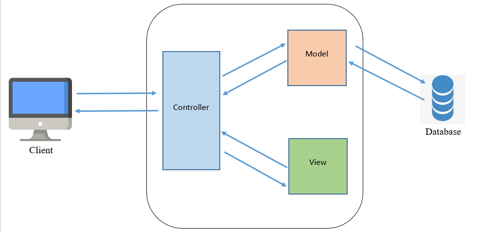

# Candy Care Dublin

The live link can be found <a href="https://candycaredublin.herokuapp.com/" target="_blank" rel="noopener">here</a>.

This project was created as part of the Full Stack Software Development course offered by Code Institute.

# Table of Contents

- [Candy Care Dublin](#candy-care-dublin)
- [Table of Contents](#table-of-contents)
- [Project Architecture](#project-architecture)
  - [Django Framework](#django-framework)
    - [What is Django?](#what-is-django)
    - [Why did I choose Django to work with?](#why-did-i-choose-django-to-work-with)
  - [Django Architecture](#django-architecture)
    - [Django Project MVT Structure](#django-project-mvt-structure)
    - [MVT (Model-View-Template)](#mvt-model-view-template)
  - [Design Architecture](#design-architecture)
    - [MVT Django Project Structure](#mvt-django-project-structure)
- [Acknowledgements](#acknowledgements)
- [Disclaimer](#disclaimer)
- [Author](#author)

# Project Architecture

## Django Framework

**The web framework for perfectionists with deadlines.**

### What is Django?

Django is a free and open-source web application framework written in Python. It is used for rapid web development and clean, pragmatic design. It is built by experienced developers to make repetitive tasks easier, so we can focus on writing apps instead of reinventing the wheel. Django was created in 2003 when web developers at the Lawrence Journal-World newspaper started using Python for their web development. After creating a number of websites, they started to factor out and reuse lots of common code and design patterns. That common code led to a generic web development framework that was open-sourced as the “Django” project in 2005. Since the original developers were surrounded by newspaper writers, well-written documentation is a key part of Django. This means that there are excellent references to check out on the official Django documentation pages. The Django framework is extremely large, but the Django community is absolutely massive. The community has contributed a lot of third-party code for Django. No matter what we are trying to do, there’s a good chance that we will find the solution for it on djangopackages.org. The website includes everything, from authentication and authorization to full-on Django-powered content management systems, from e-commerce add-ons to integrations with Stripe.

### Why did I choose Django to work with?

While Django is most often used for web development, it can be used for many other purposes as well. It is a highly-regarded piece of software and is highly recommended for anyone who is serious about their web development. It can be used to build large e-commerce websites, blogging sites, or anything else that requires a scalable, high-performing website. In this article, we are going to cover all the basics you need to know to get started with Django. We will cover topics such as setting up your development environment and installing and using Django. We will also cover how to choose the right Django installation for your needs and how to get the most out of the framework by using best practices. Here are some reasons why I chose to work with Django:

 - Django is a great option for beginner and advanced developers alike. It’s very easy to learn and install, and it doesn’t require any external tools or libraries. It can be used to build any type of web or mobile app, from the simplest to the most complex. Django is often cited as a “best practices” application development framework, because it follows a consistent structure, provides everything developers might need and is very easy to use.
 
 - This flexibility is what makes Django such a popular choice for building websites. It’s easy to learn, easy to implement, and can be extended with a huge range of tools and libraries. It’s also very quick to create a website with and can be up and running in a matter of days.
 
 - Ridiculously fast.
     - Django was designed to help developers take applications from concept to completion as quickly as possible. 

 - Reassuringly secure.
     - Django takes security seriously and helps developers avoid many common security mistakes.

 - Exceedingly scalable.
     - Some of the busiest sites on the web leverage Django’s ability to quickly and flexibly scale.

## Django Architecture

Before we really get into the Django universe, let's talk about the software architecture model.

The most popular software architecture, by far, is the Model-View-Controller, or MVC.

Model–view–controller (MVC) is a software architectural pattern commonly used for developing user interfaces that divide the related program logic into three interconnected elements. This is done to separate internal representations of information from the ways information is presented to and accepted from the user.

MVC divides any large application into three parts:

  1. The Model
  2. The View
  3. The Controller

Read more in [Wikipedia](https://en.wikipedia.org/wiki/Model%E2%80%93view%E2%80%93controller).

### Django Project MVT Structure

Every web application is basically divided into three main sections: **input data**, **business logic**, and **user interface**.

The code has certain functions to perform, the input data is the dataset and how it is stored in the database. It is just a matter of delivering the input to the database in the desired format. The Business Logic is what controls the output of the server in HTML or another format. The HTML and CSS are the pages that it is written for. These days, the approach taken is different. The content is gathered from multiple sources and stored in separate files. This is known as page streaming, and it is a widely used approach for website content. The code for the webpage is stored in one file and the HTML, CSS and JS are stored in separate files. The content is streamed from the server and rendered in the browser.

### MVT (Model-View-Template)

Django is based on Model-View-Template architecture. MVT is a design pattern or design architecture that Django follows to develop web applications.

MVT determines the total structure and workflow of a Django application. In an MVT architecture

 - The **Model** manages the data and is represented by a database. A model is basically a database table.
 - The **View** receives HTTP requests and sends HTTP responses. A view interacts with a model and template to complete a response. It is in **View** where the application logic is present.
 - The **Template** is basically the front-end layer and the dynamic HTML component of a Django application. The **Template** layer handles the staticfiles such as CSS, JavaScript and Images.

Below I show how the application architecture was designed, based on Django's MVT pattern structure.

## Design Architecture

### MVT Django Project Structure

# Acknowledgements

I would like to take the opportunity to thank:

 - To God first, to my family, friends and colleagues for their advice, support and help with testing.
 - To my mentors Felipe Alarcon & Richard Wells for their feedback, advices, support and, above all, for their patience.
 - All Code Institute Tutors and Community on Slack for the peer reviews and advice.

# Disclaimer

> ****Disclaimer***: The following Context is completely fictional, the company, the context, the CEO, the business questions exist only in my imagination.

> **For educational purposes only.

# Author

Made with ❤️ by <b>Emidio Valereto</b>  Get in touch!

 